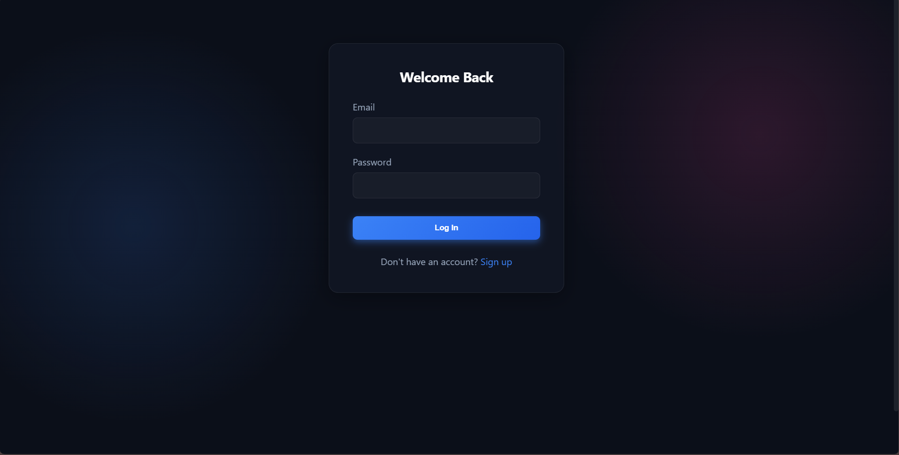
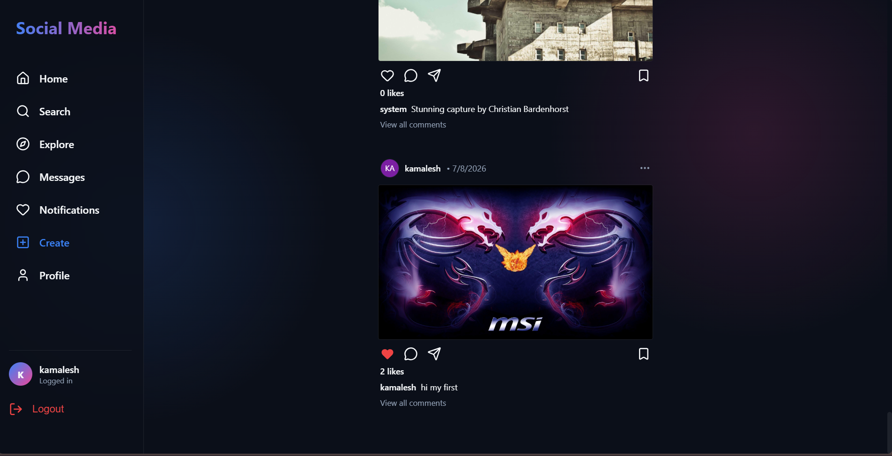
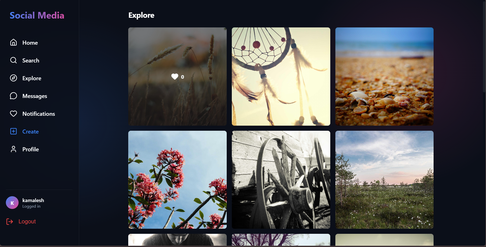

<div align="center">
  

  <h1 align="center">🌌 OmniSocial</h1>

  <p align="center">
    <strong>A next-generation, high-performance social media platform featuring a stunning glassmorphism UI, real-time WebSocket interactions, and live algorithmic data seeding.</strong>
  </p>

  <p align="center">
    <a href="https://reactjs.org/"></a>
    <a href="https://vitejs.dev/"></a>
    <a href="https://nodejs.org/"></a>
    <a href="https://socket.io/"></a>
    <a href="https://www.sqlite.org/"></a>
  </p>
</div>

<hr />

## 📖 Table of Contents
- [✨ Key Features](#-key-features)
- [📸 Gallery](#-gallery)
- [🛠️ Architecture & Tech Stack](#️-architecture--tech-stack)
- [🚀 Getting Started](#-getting-started)
- [💻 Live Features Overview](#-live-features-overview)
- [📄 License](#-license)

---

## ✨ Key Features

- **🎨 Premium Glassmorphism UI**: A custom, vibrant dark-mode aesthetic utilizing deep background gradients and `backdrop-filter` for a luxurious frosted glass effect.
- **⚡ Real-Time Engine**: Powered by `Socket.io`, all interactions (new posts, likes, and comments) are broadcasted to all connected clients instantly without refreshing the page.
- **📱 Instagram-Inspired Layout**: Features a fixed left sidebar for seamless navigation and a centralized, highly-focused feed that scales perfectly across devices.
- **🌍 Live Data Seeding**: The backend automatically fetches real, trending, high-quality images from the internet on startup so the feed is never empty.
- **🔐 Secure Authentication**: Includes JWT-based authentication and secure `bcrypt` password hashing.
- **🖼️ Native File Uploads**: Robust backend file handling with `multer` allowing users to upload physical images and videos seamlessly.

---

## 📸 Gallery

Here is a look at OmniSocial in action! 
*(Note: To display your screenshots here, save the screenshots you took into a `docs/` folder in this repository and name them `login.png`, `feed.png`, and `explore.png`)*

<div align="center">
  <h3>Secure Login & Authentication</h3>
  
  <p><i>A sleek, distraction-free authentication gateway.</i></p>

  <h3>Real-Time Home Feed</h3>
  
  <p><i>Live data scrolling, instant likes, and real-time comment injection.</i></p>

  <h3>Algorithmic Explore Page</h3>
  
  <p><i>A responsive CSS Grid layout designed for infinite content discovery.</i></p>
</div>

---

## 🛠️ Architecture & Tech Stack

OmniSocial is designed to be lightweight yet immensely powerful, adopting a standard SPA (Single Page Application) architecture coupled with an event-driven Node API.

### ⚛️ Frontend
- **Vite + React**: Chosen for blazing-fast Hot Module Replacement (HMR) and optimized production builds.
- **React Router DOM**: Handles dynamic client-side routing between Home, Explore, and Profile pages.
- **Axios**: Manages standard REST HTTP requests securely attaching JWT tokens.
- **Vanilla CSS**: Heavily customized styling to achieve complex glassmorphism without heavy UI libraries.

### 🟢 Backend
- **Express.js**: REST API routing layer handling authentication, posts, and media serving.
- **Socket.IO**: Maintains constant duplex connections for instant payload delivery.
- **SQLite3**: A self-contained, serverless database engine for rapid development and testing.
- **Bcrypt & JWT**: Industry-standard cryptographic packages for securing user data.

---

## 🚀 Getting Started

Follow these steps to run the platform locally on your machine.

### 1. Clone the Repository
```bash
git clone https://github.com/kamalesh4044/social-media.git
cd social-media
```

### 2. Start the Backend
The backend runs on **Port 3000**.
```bash
cd backend
npm install
node server.js
```
*Note: The server will automatically seed the SQLite database with real images upon startup!*

### 3. Start the Frontend
The frontend runs on **Port 5173**. Open a new terminal window:
```bash
cd frontend
npm install
npm run dev
```

### 4. Verify Live Functionality
1. Open `http://localhost:5173` in your browser.
2. Sign up for a new account.
3. Open a second window (Incognito) and sign up with a different account.
4. Try uploading a post or dropping a comment in one window—watch it instantly appear in the other!

---

## 💻 Live Features Overview

| Feature | Status | Description |
| :--- | :---: | :--- |
| **Authentication** | 🟢 | Login, Registration, JWT generation, Bcrypt hashing |
| **Real-Time Feed** | 🟢 | Socket.io broadcasting for posts, likes, and comments |
| **Media Uploads** | 🟢 | Local physical file storage handled natively by Multer |
| **Explore Grid** | 🟢 | Randomized layout of top visual content |
| **Live Seeding** | 🟢 | Automatic internet scraping to keep the DB fresh |

---

<div align="center">
  <i>Built with passion by Kamalesh</i>
</div>
